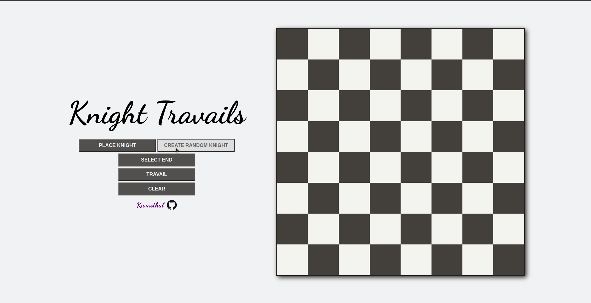

# Knight Travails

↠ <a href='https://kiwasthal.github.io/Knight-travails/'>PROJECT DEMO<a/> ↞

  
  

    
A visual represantation of a knights travel's to it's destination on the chessboard(hopefully) via the optimal path!

    <h4>How ? </h4>
    <ol>
      <li>Create a knight either by selecting the place button and clicking on a board square or by generating a random starting knight.</li>
      <li>Click on the end button and select an ending destination for your knight on the board.</li>
      <li>Travail!</li>
    </ol>
  

### Notes

Created as part of <a href='https://www.theodinproject.com/lessons/javascript-knights-travails'>The Odin Project CS course.</a>

A friend of mine once challenged me to find the solution of a knight travailing the chess board, passing each square only once, i have never figured it out, perhaps i should return to the old problem sometime soon and provide a full solution.

Knight vector taken from <a href="https://www.svgrepo.com/svg/162875/knight">SVG repo </a>.
